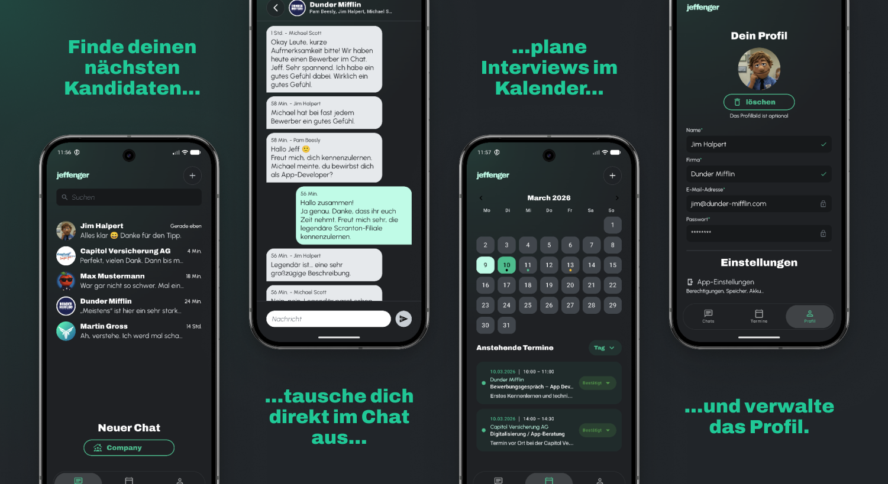

# Jeffenger  
(🇬🇧 README here)

---

## 📱 Try the App via Firebase App Tester

Scan the QR code below to install **Jeffenger** on your Android device:

> **Requires Android 8.0 (Oreo) or newer**  
> The app is distributed via **Firebase App Distribution**.  
> The Firebase App Tester app may be required to install and test the build.

---

# 🌟 What is Jeffenger?

**Jeffenger** is a **messenger-style portfolio app** built with **Kotlin**, **Jetpack Compose**, and **Firebase**.

The idea behind Jeffenger is simple:  
Instead of only viewing my portfolio, **recruiters and developers can directly interact with me through the app**.

The app simulates a modern messaging environment where conversations, profile information, and professional data are combined into a single interactive experience.

Jeffenger was created as a **demonstration project for modern Android architecture**, showcasing clean structure, scalable components, and real-time backend integration.

This project was developed as part of my professional training.

---

## ✨ Features

- ✅ Modern **messenger-style interface**
- ✅ Chat overview with conversation previews
- ✅ Chat detail screen with message bubbles
- ✅ Profile screen displaying account information
- ✅ Calendar view for potential interview scheduling
- ✅ Bottom navigation between core sections
- ✅ Firebase Authentication integration
- ✅ Real-time data via **Firebase Firestore**
- ✅ Modular UI components using Jetpack Compose
- ✅ Dark mode optimized interface

---

## 🧠 Technologies

- Kotlin
- Android Studio
- Jetpack Compose
- Firebase Authentication
- Firebase Firestore
- MVVM + Repository architecture
- Dependency Injection with **Koin**
- Kotlin Coroutines & Flow
- Navigation Compose
- Material Design 3
- Modular reusable UI components

---

## 🏗 Architecture

Jeffenger follows a **clean and scalable architecture** to separate responsibilities between UI, business logic, and data sources.

Main architectural concepts used:

- **MVVM (Model–View–ViewModel)**
- **Repository Pattern** for data abstraction
- **Dependency Injection with Koin**
- **Reactive UI updates via StateFlow**
- **Composable UI components for reusability**

This structure ensures maintainability, testability, and a clear separation of concerns.

---

## 🚀 How to Run

1. Click the green **"Code"** button on this repository and download the ZIP file.  
2. Open the project in **Android Studio**.  
3. Let Gradle sync complete and ensure an emulator or Android device is connected.  
4. Click **Run ▶️** to build and launch the app.

---

📝 **Disclaimer**

This project was developed as part of my professional training at the Syntax Institut as part of the App Developer program.  
All source code, structure, and documentation are my own work.  
Developed collaboratively with ChatGPT – OpenAI – as part of an assisted coding process.

© 2026 Jeff Braun. All rights reserved.  
Licensed under the [MIT License](./LICENSE).

---------------------------------------------------------------------------------------------------------------------------------

# Jeffenger  
(🇩🇪 README hier)

---

## 📱 App über Firebase App Tester ausprobieren

Scannen Sie den folgenden QR-Code, um **Jeffenger** auf Ihr Android-Gerät zu installieren:

> **Benötigt Android 8.0 (Oreo) oder neuer**  
> Die App wird über **Firebase App Distribution** verteilt.  
> Zum Installieren kann die **Firebase App Tester App** erforderlich sein.

---

# 🌟 Was ist Jeffenger?

**Jeffenger** ist eine **Messenger-ähnliche Portfolio-App**, die mit **Kotlin**, **Jetpack Compose** und **Firebase** entwickelt wurde.

Die Idee hinter Jeffenger ist, mein Portfolio nicht nur statisch darzustellen,  
sondern **Recruitern und Entwicklern eine direkte Interaktion mit mir zu ermöglichen**.

Die App simuliert eine moderne Messaging-Umgebung, in der Chats, Profilinformationen und berufliche Daten miteinander kombiniert werden.

Jeffenger dient gleichzeitig als **Demonstrationsprojekt für moderne Android-Architektur**.

Dieses Projekt wurde im Rahmen meiner beruflichen Ausbildung entwickelt.

---

## ✨ Funktionen

- ✅ Moderne **Messenger-ähnliche Benutzeroberfläche**
- ✅ Chat-Übersicht mit Konversationsvorschau
- ✅ Chat-Detailansicht mit Nachrichtenblasen
- ✅ Profilscreen mit Account Informationen
- ✅ Kalenderansicht zur möglichen Terminplanung
- ✅ Bottom Navigation zwischen den Hauptbereichen
- ✅ Firebase Authentication Integration
- ✅ Echtzeitdaten über **Firebase Firestore**
- ✅ Wiederverwendbare UI-Komponenten mit Jetpack Compose
- ✅ Optimiert für Dark Mode

---

## 🧠 Technologien

- Kotlin
- Android Studio
- Jetpack Compose
- Firebase Authentication
- Firebase Firestore
- MVVM + Repository Architektur
- Dependency Injection mit **Koin**
- Kotlin Coroutines & Flow
- Navigation Compose
- Material Design 3
- Modulare wiederverwendbare UI Komponenten

---

## 🏗 Architektur

Jeffenger verwendet eine **skalierbare und saubere Architektur**, um UI, Business-Logik und Datenquellen voneinander zu trennen.

Verwendete Konzepte:

- **MVVM (Model–View–ViewModel)**
- **Repository Pattern**
- **Dependency Injection mit Koin**
- **Reaktive UI-Updates über StateFlow**
- **Composable UI-Komponenten für Wiederverwendbarkeit**

---

## 🚀 App starten

1. Klicken Sie auf den grünen **"Code"** Button in diesem Repository und laden Sie das Projekt herunter.  
2. Öffnen Sie das Projekt in **Android Studio**.  
3. Lassen Sie Gradle synchronisieren und verbinden Sie ein Android-Gerät oder einen Emulator.  
4. Starten Sie die App über **Run ▶️**.

---

📝 **Haftungsausschluss**

Dieses Projekt wurde im Rahmen meiner beruflichen Ausbildung am Syntax Institut als Teil des App-Developer-Programms entwickelt.  
Der gesamte Quellcode, die Struktur und die Dokumentation sind meine eigene Arbeit.  
Entwickelt in Zusammenarbeit mit ChatGPT – OpenAI – als Teil eines assistierten Codierungsprozesses.

© 2026 Jeff Braun. Alle Rechte vorbehalten.  
Lizenziert unter der [MIT-Lizenz](./LICENSE).
